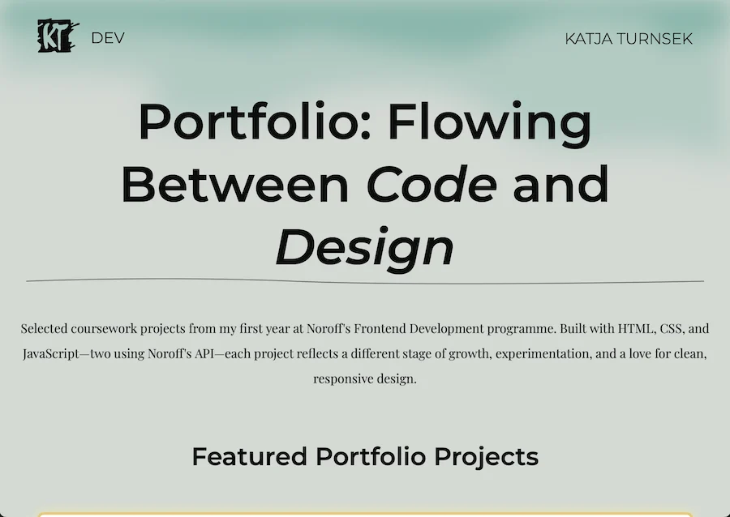

# Portfolio

A single-page portfolio site built for the Portfolio 1 assignment at Noroff. It showcases three selected projects from the first year of the Frontend Development programme, along with a personal reflection.

## 🌐 Live Site

[https://katjaturnsek.github.io/portfolio-noroff/](https://katjaturnsek.github.io/portfolio-noroff/)

## 💻 GitHub Repository

[https://github.com/KatjaTurnsek/portfolio-noroff](https://github.com/KatjaTurnsek/portfolio-noroff)

## 📝 Description

This site introduces key projects completed during the first year of study, each presented with a short summary, project preview, and links to both the GitHub repo and live demo. It reflects my growth in frontend technologies and project execution.

Also included is a downloadable PDF reflection covering insights and self-assessment across the featured work.

### 🔗 Featured Projects

- **Rainydays**  
  E-commerce product page with a responsive layout, shopping cart functionality, and API integration.

- **Semester Project 1**  
  Informational website for a fictional science museum, focused on accessibility, content structure, and clean layout.

- **Exam Project 1 (Agility Bandits Blog)**  
  A blog-style site using the Noroff API, featuring dynamic posts, a carousel, and admin features.

## 🛠️ Tech Stack

- HTML5  
- CSS3  
- JavaScript  
- Noroff Blog API  

## 📄 Reflection PDF

[📘 Read the Reflection Document](assets/pdf/portfolio-reflection.pdf)

## 🙋‍♀️ Author

**Katja Turnšek**  
Frontend Development Student at Noroff  
[Visit my Portfolio Site](https://katjaturnsek.github.io/portfolio-noroff/)
